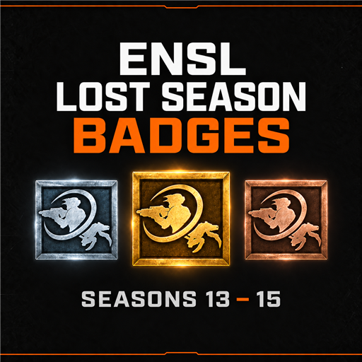

# ENSL Lost Season Badges

A Natural Selection 2 mod project restoring tournament badges for NSL Seasons 13–15, using existing ENSL badges as the visual and behavioral reference.

**Status:** plan accepted; corrected Workshop cover and in-game art comparison prepared; native hover behavior inspected. Recipient verification, final texture refinement, and runtime implementation remain. There is no playable mod yet.

## Project documents

- [Accepted implementation plan](PLAN.md)
- [Existing badge artwork and proposed direction](docs/artwork.md)
- [Hover panels and proposed badge names](docs/hover-behavior.md)
- [Corrected artwork prompts](docs/artwork-correction-prompts.md)
- [Historical preview prompts](docs/preview-prompt.md)

The cover is available as 512 x 512 PNG and JPEG. [Compare S12, proposed S13–15, and S16 medals](docs/medal-comparison.png) enlarged and at the scoreboard base size. S13 proposes reuse of original 2018 art; S14/S15 use corrected 2019 drafts. Final game textures and registration remain to be completed.

## Award policy

Use current ENSL standings, remove disqualified teams from the relevant competition, and promote remaining teams in order. Preserve published placement separately from the mod's promoted award.

Season 13 Division 1 bronze is omitted because the historical records are unavailable. The accepted scope contains 16 established awarded team placements across Seasons 13–15. S15 D1 bronze is unassigned unless the next eligible team can be verified.

Primary results source: [ENSL Hall of Fame](https://www.ensl.org/halloffame).

## Distribution

The proposed mod grants account-specific custom badges on servers running it. It does not issue official Steam inventory items. A GitHub remote and Workshop release have not been created.
