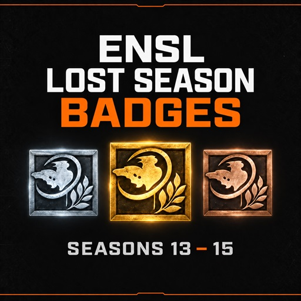

# ENSL Lost Season Badges

A Natural Selection 2 mod project restoring tournament badges for NSL Seasons 13–15, using existing ENSL badges as the visual and behavioral reference.

**Status:** v1.0 prepared for Workshop upload: 16 medal definitions, 119 distinct awards across 105 confirmed accounts. All remaining proposed accounts were approved by Bleu; Void is assigned to 60207928. Made_in_Russia remains unassigned, and the Void/Reguliym overlap is tracked in [GitHub issues](https://github.com/Bleuitup/ENSL-Lost-Season-Badges/issues). Workshop v0.81 is the last user-confirmed published release.

## Tested v0.8 prototype

Open this project in NS2 Launchpad and follow the [test instructions](docs/launchpad-test.md). The local `output` folder is prepared. The v0.8 tag contains the original one-badge prototype. The current local build includes verified recipients across S13–15. Bleu can now test both S13 D3 gold and S14 bronze; both are earned awards listed in the Hall of Fame.

The upload is built exclusively from `source/`. Research, markdown, reference images, and selected artwork masters stay outside the runtime package. Superseded image candidates were removed from the current checkout; they remain recoverable from Git tag `v0.8`.

## Project documents

- [Release notes and v1.0 upload](docs/release-notes.md)

- [Accepted implementation plan](PLAN.md)
- [Launchpad test and requested feedback](docs/launchpad-test.md)
- [Prototype architecture and provenance](docs/prototype-architecture.md)
- [Recipient review and remaining questions](docs/recipient-review.md)
- [Recipient evidence manifest](data/recipients.json)
- [Selected artwork and comparison](docs/artwork.md)
- [Approved option C and generation prompts](docs/nine-alternatives.md)
- [Hover panels and proposed badge names](docs/hover-behavior.md)
- [Initial year-edit prompt and method](docs/year-edit-prompt.md)
- [Earlier artwork correction prompts](docs/artwork-correction-prompts.md)
- [Historical preview prompts](docs/preview-prompt.md)

The Workshop cover is the 512 x 512 `preview.jpg` in the project root. [Compare S12, proposed S13–15, and S16 medals](docs/medal-comparison.png) enlarged and at the scoreboard base size. S13 proposes reuse of original 2018 art; S14/S15 use approved option C, stored in `assets/badges/2019/`. All 16 established awards have native DDS files and registration. S13 uses byte-identical shipped 2018 textures; S14/S15 use lossless 32 x 32 DDS exports of the approved C PNGs. The expanded set still needs an in-game visual check.

## Award policy

Use current ENSL standings, remove disqualified teams from the relevant competition, and promote remaining teams in order. Preserve published placement separately from the mod's promoted award.

Season 13 Division 1 bronze is omitted because the historical records are unavailable. The accepted scope contains 16 established awarded team placements across Seasons 13–15. S15 D1 bronze is unassigned unless the next eligible team can be verified.

Primary results source: [ENSL Hall of Fame](https://www.ensl.org/halloffame).

## Distribution

The proposed mod grants account-specific custom badges on servers running it. It does not issue official Steam inventory items. The user published [Workshop v0.8](https://steamcommunity.com/sharedfiles/filedetails/?id=3802094438). The annotated Git tag `v0.8` records the tested source and uploaded project metadata/preview. Source and tracked issues: [GitHub repository](https://github.com/Bleuitup/ENSL-Lost-Season-Badges). The `v1.0` Git tag identifies the prepared upload; publication is performed by Bleu.
