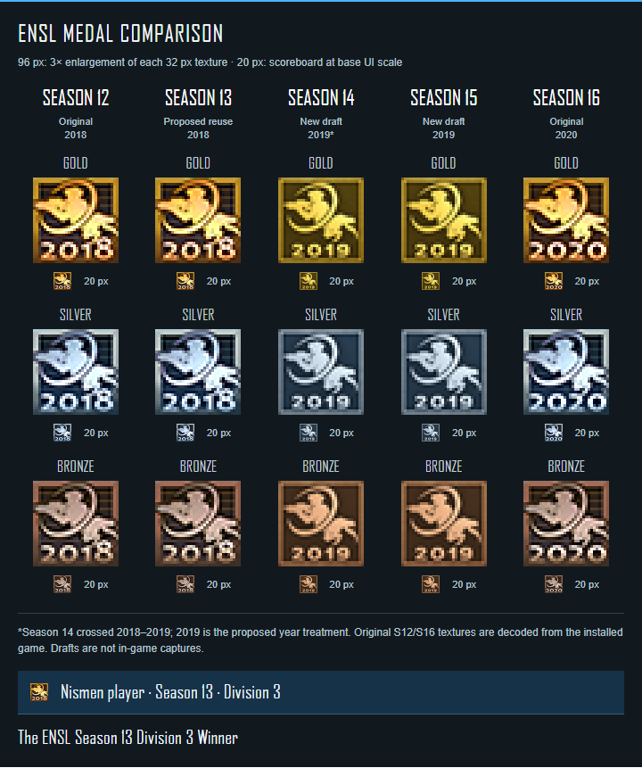

# Artwork reference and current drafts

## Side-by-side comparison

Each large image is a nearest-neighbor 96 x 96 enlargement of a 32 x 32 texture. The small images are displayed at 20 x 20 pixels, the scoreboard's base icon size. Actual game size is multiplied by its UI scaling factor; browser and operating-system scaling also affect physical screen size. The comparison is a browser rendering, not an NS2 screenshot.

| Season | Artwork in this comparison | Status |
| --- | --- | --- |
| 12 | Installed `ensl_2018_{gold,silver,bronze}.dds` | Original reference |
| 13 | Same original 2018 textures | Proposed reuse under separate custom award identifiers |
| 14 | Corrected generated 2019 variants | Draft; 2019 year treatment proposed for the 2018–2019 season |
| 15 | Same corrected 2019 variants | Draft |
| 16 | Installed `ensl_s16_{gold,silver,bronze}.dds` | Original reference |

The S14/S15 draft has the corrected emblem and colored interiors. It still differs from the originals in brightness, frame treatment, silhouette proportions, and numeral size. Final texture work should match the shipped art more closely before release. The generated high-resolution sheet is design input, not a native pixel-art master; downsampling alone does not make it a finished game texture.

## Emblem correction

The ENSL emblem shows a helmeted Marine aiming a rifle left, an incomplete curved arc, and a Skulk facing right at the lower right. It is not a Gorge head or a laurel. The former interpretation and promotional art were incorrect and are superseded.

Authoritative shape reference: [ENSL website logo](https://www.ensl.org/assets/themes/default/logo-19ca99c1.png), preserved as `ensl-site-logo.png`. The lettering and blue website banner are excluded from the medal emblem.

Badge interiors should carry a subdued tint of their metal: gold/brown, steel blue/gray, or copper/brown. They should not be treated as plain black or assumed to be transparent. Preserve the original asset's alpha when referencing it; the new generated drafts are opaque.

Season 12 divisions share three textures but have separate award identifiers and names. Our divisions can do the same. S13 D1 bronze is omitted, and S15 D1 bronze remains unassigned; displaying a bronze design here is not an eligibility decision.

## Files

- `assets/drafts/2019-medals-master.png`: corrected generated design sheet.
- `assets/drafts/corrected_2019_*_32.png`: 32 x 32 design drafts.
- `assets/drafts/corrected_2019_*_20.png`: independent 20 x 20 exports for inspection. The comparison uses the same 32 px source for every medal and browser scaling to 20 px.
- `docs/medal-comparison.png`: all five seasons, enlarged and small.
- `docs/nismen-hover-comparison.png`: illustrative native-style hover panel.
- `docs/hover-behavior.md`: source audit and proposed badge names.

The installed declarations reference separate scoreboard paths for some medals, but corresponding `_20.dds` files were absent from the inspected folder. Verify the actual texture paths and filtering in NS2 before claiming a working implementation. No final DDS or runtime registration is included yet.

## Workshop cover

The corrected cover keeps the user's black/orange preview style and replaces the erroneous emblem. Medal interiors now have matching metallic tints. Promotional detail and glow are not intended for in-game icons.

- `preview.png` and `preview.jpg`: exact 512 x 512 exports.
- `assets/preview-master.png`: corrected generated master.
- `docs/artwork-correction-prompts.md`: exact built-in ImageGen correction prompts.
- `docs/preview-prompt.md`: retained historical prompts, marked superseded where wrong.

Original NS2 artwork and the ENSL logo belong to their respective creators. These source references document the intended match; redistribution conditions remain part of release preparation.
