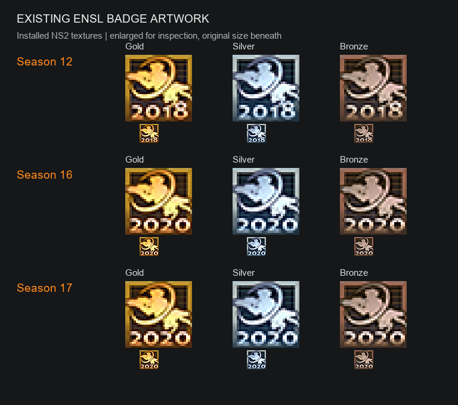

# Artwork reference and direction

## Existing in-game medals

These are decoded copies of the installed NS2 textures, enlarged with nearest-neighbor scaling for inspection. The small versions underneath show the original 32 x 32 pixels. They are reference artwork, not new Season 13/14/15 textures.

- Season 12: gold, silver, bronze; Gorge emblem and 2018 year. The three divisions share artwork but have separate names and award identifiers.
- Seasons 16 and 17: the same general medal family with 2020 beneath the emblem.
- Source files: ns2/ui/badges/ensl_2018_{gold,silver,bronze}.dds, ensl_s16_{gold,silver,bronze}.dds, and ensl_s17_{gold,silver,bronze}.dds from the local NS2 installation.
- Original game artwork belongs to its respective creators; this reference sheet documents the design being matched.

## Proposed in-game direction

Keep the compact Gorge emblem, medal colors, transparent silhouette, and native scale. Use season/division/place in the tooltip. Season 13 took place in 2018; Season 14 crossed 2018–2019; Season 15 took place in 2019. Settle the Season 14 year treatment when preparing actual textures, instead of accidentally displaying Season 12's year.

There are 16 established awarded team placements. No S13 D1 bronze recipient or award is planned. S15 D1 bronze is unassigned unless the next eligible team can be verified. Distinct award identifiers may share the same visual texture.

The game declares separate scoreboard paths for some medals, but the installed ENSL Season 12/16/17 files inspected here only contain their base textures. Verify both display paths in the prototype.

## Workshop cover

The 512 x 512 cover matches the user's black/orange preview family, with metallic medals as the central illustration. This generated cover is promotional artwork; it is not the pixel-perfect in-game badge artwork.

- preview.png: exact 512 x 512 PNG export.
- preview.jpg: exact 512 x 512 JPEG export for the NS2 preview-file convention.
- assets/preview-master.png: original generated master.
- docs/preview-prompt.md: exact prompt, method, and references.

## Next implementation work

1. Create the sourced recipient manifest for the accepted placements and verify Steam-to-NS2 account links.
2. Prepare native-sized Season 13/14/15 badge textures based on these references.
3. Implement and test one account-bound custom badge before expanding to all awards.
