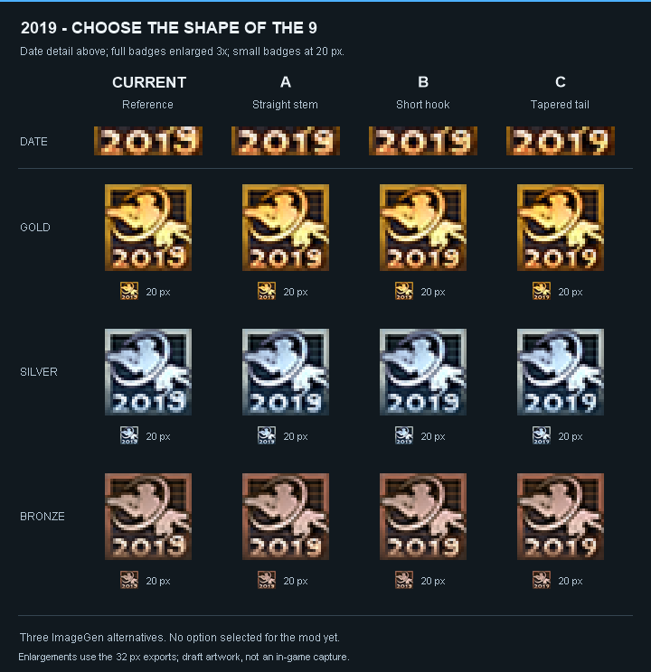

# Alternatives for the final digit in 2019

Status: the user selected C (tapered tail) on 2026-09-15. Its three 32 px medal exports are copied unchanged into `assets/badges/2019/` as the selected S14/S15 artwork.

Generated on 2026-09-15 with the built-in ImageGen tool, one separate edit call per alternative. Input for each call: `assets/drafts/year-edit-2019-master.png`. All three calls requested a change only to the final 9, matching the height and baseline of the other digits and avoiding a flared base. Generative edits are not guaranteed to preserve all other pixels or reproduce the same glyph exactly across medal colors.

- A: straight-stem direction.
- B: short-hook direction.
- C: tapered diagonal-tail direction.

These names describe the requested direction; the displayed output is what the user should judge. C is the clearest tapered form in the gold preview. Finalizing a selected style should include checking consistency across gold, silver and bronze.

## Files and comparison method

`assets/drafts/nine-alternatives/` contains the three original generated masters and nine 32 x 32 medal exports. Each master is a 1254 x 1254 atlas with gold top-left, silver top-right and bronze bottom-left. The cells were cropped and reduced with high-quality bicubic resampling. The mosaic shows 32 px exports enlarged to 96 px using nearest-neighbor scaling; its date details are a 4x enlargement of the same exports. Small badges are 20 px in the PNG, with the same filtering for every option. Viewer scaling can change their physical size on screen. This is an art review, not an NS2 screenshot.

The mosaic is retained as selection history: its CURRENT column shows the prior year-edit master. The main five-season comparison now uses selected option C. The chosen art is ready for native texture packaging and in-game integration.

## Exact prompts

### A — Straight stem

Use case: precise-object-edit.
Edit target: the supplied three-medal pixel-art atlas. Gold top-left, silver top-right, bronze bottom-left; plain dark gray bottom-right. Preserve this exact gapless 2x2 composition.
User-approved badge art must remain unchanged: original colors, tinted background pixel patterns, Marine/rifle/large semicircular arc/Skulk silhouettes, frame, and existing "201" digits. Change ONLY the final digit "9" in each "2019" year.
The current 9 is defective: it extends above the other digits and has a wide, flared lower base. Correct both issues. Its TOP must align exactly with the top of the adjacent 0 and 2; its BASELINE must align exactly with theirs. It must be the SAME HEIGHT as 201, never taller. Match their stroke weight, pixel size, shading, gold/silver/bronze palette, and baseline. The lower half of the 9 must never be wider than its upper bowl. Keep a clearly readable 9, not a 3, 8, 4 or g. Keep "201" pixel shapes and positions intact. Keep the overall year width and inter-digit spacing balanced.
This is deliberately tiny game pixel art, not a high-resolution redraw: preserve the coarse 32x32 logical pixel grid per badge and the source's softness. No smooth new font, no extra decoration or words, no new border, no labels on the output, no logo change. Apply the same 9 silhouette consistently to all three medals.

Variant A: classic closed upper bowl, a clean straight right-hand descending stem, and a short inward terminal at the baseline. The stem is much narrower than the bowl; absolutely no flared or broad bottom foot. Keep the bowl the width of the neighboring 0.

### B — Short hook

Use case: precise-object-edit.
Edit target: the supplied three-medal pixel-art atlas. Gold top-left, silver top-right, bronze bottom-left; plain dark gray bottom-right. Preserve this exact gapless 2x2 composition.
User-approved badge art must remain unchanged: original colors, tinted background pixel patterns, Marine/rifle/large semicircular arc/Skulk silhouettes, frame, and existing "201" digits. Change ONLY the final digit "9" in each "2019" year.
The current 9 is defective: it extends above the other digits and has a wide, flared lower base. Correct both issues. Its TOP must align exactly with the top of the adjacent 0 and 2; its BASELINE must align exactly with theirs. It must be the SAME HEIGHT as 201, never taller. Match their stroke weight, pixel size, shading, gold/silver/bronze palette, and baseline. The lower half of the 9 must never be wider than its upper bowl. Keep a clearly readable 9, not a 3, 8, 4 or g. Keep "201" pixel shapes and positions intact. Keep the overall year width and inter-digit spacing balanced.
This is deliberately tiny game pixel art, not a high-resolution redraw: preserve the coarse 32x32 logical pixel grid per badge and the source's softness. No smooth new font, no extra decoration or words, no new border, no labels on the output, no logo change. Apply the same 9 silhouette consistently to all three medals.

Variant B: classic closed upper bowl matching the neighboring 0 width, with a short slightly inward-curving lower hook. The hook stays underneath the bowl's right half, with a small leftward tip. Its terminal is narrow, not a wide base. All digits have identical top and baseline alignment.

### C — Compact diagonal

Use case: precise-object-edit.
Edit target: the supplied three-medal pixel-art atlas. Gold top-left, silver top-right, bronze bottom-left; plain dark gray bottom-right. Preserve this exact gapless 2x2 composition.
User-approved badge art must remain unchanged: original colors, tinted background pixel patterns, Marine/rifle/large semicircular arc/Skulk silhouettes, frame, and existing "201" digits. Change ONLY the final digit "9" in each "2019" year.
The current 9 is defective: it extends above the other digits and has a wide, flared lower base. Correct both issues. Its TOP must align exactly with the top of the adjacent 0 and 2; its BASELINE must align exactly with theirs. It must be the SAME HEIGHT as 201, never taller. Match their stroke weight, pixel size, shading, gold/silver/bronze palette, and baseline. The lower half of the 9 must never be wider than its upper bowl. Keep a clearly readable 9, not a 3, 8, 4 or g. Keep "201" pixel shapes and positions intact. Keep the overall year width and inter-digit spacing balanced.
This is deliberately tiny game pixel art, not a high-resolution redraw: preserve the coarse 32x32 logical pixel grid per badge and the source's softness. No smooth new font, no extra decoration or words, no new border, no labels on the output, no logo change. Apply the same 9 silhouette consistently to all three medals.

Variant C: slightly narrower closed upper bowl with a short diagonal tail descending inward toward the bottom center, tapering to a single-pixel-width terminal. Keep the full 9 exactly the same height as 201 and use the same stroke weight. The lower half must visibly taper, never broaden.
